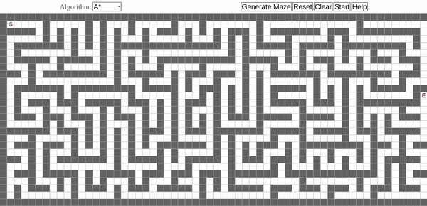

# Table of Contents
* [Description](#Description)
* [Prerequisites](#Prerequisites)
* [Installing the project](#installing-the-project)
* [Using Path Finding](#using-path-finding)
* [Features](#Features)

# Description
* Path finding algorithms implementation using **p5.js**
* Official **p5.js** website: https://p5js.org/

# Prerequisites
Ensure you have met the following requirements:
* You have a modern web browser that can render `HTML5 canvas`.
* You have installed **p5.js** libraries.
* You have installed `npm` package manager or `python 3.x` on your machine.
# Installing the project
* **Clone** or **download as ZIP** this repository.
* Open repository folder.
* If you use `npm`, follow these steps:
    * Install `http-server` module globally on your machine via this command:  
    ```
    npm install http-server -g
    ```
    * Run the module:  
    ```
     http-server ./ -p 5500
    ```
    * Open <a>http://localhost:5500/</a> in a web browser.

# Using Path Finding 
* **Left** mouse click will add objects.
* **Right** mouse click will remove objects.
* You can select your algorithm from top left corner.
* When you are ready, click to `start` button.
# Features
* Current algorithms:
    * A*
    * Dijkstra
    * Breadth-first Search
* For **A*** algorithm, you can choose different *heuristic* approaches:
    * Manhattan
    * Euclidean
* You can generate mazes. Maze generation algorithm:
    * Recursive backtracking(DFS)
# Contributing
1. Fork and clone the repository.
2. Create a branch: `git checkout -b <branch_name>`
3. Make your contribution and commit: `git commit -m'<commit_message>'`
4. Push it to GitHub: `git push origin <project>/<location>`
5. Create a pull request (See this page if you need help: [GitHub Pull Request Help](https://help.github.com/en/github/collaborating-with-issues-and-pull-requests/about-pull-requests))
  
All ideas and helps are welcome. For more, please contact with me.
# Authors
*Kalist Laconic (Tống Văn Nam )
*Nguyễn Hoàng Anh Khoa
*Hầu Kiến Tín


